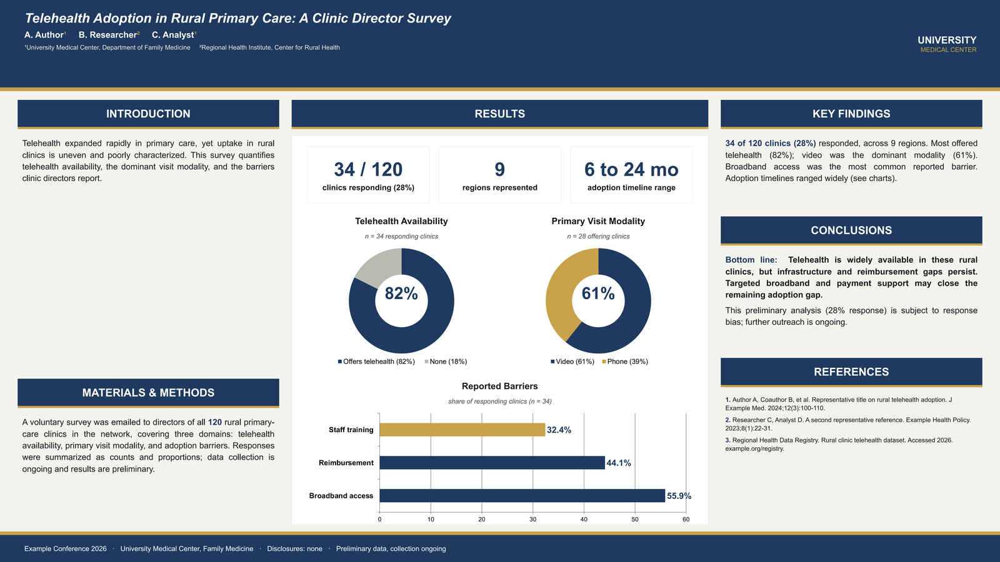

# research-poster

A Claude Code skill that turns a **PDF abstract into a polished, fully-editable scientific conference
poster** (a native PowerPoint `.pptx` plus a PDF and a preview image) with honest charts, verified
citations, big readable typography, and a render-and-QA loop. It can match an existing poster's house
style, and it runs interactively or fully autonomously.



*A fictional worked example (placeholder data) built by the runnable script in
`skills/research-poster/references/examples/`. This is the actual output: native editable charts,
honest `n/N` labels, and poster-scale typography, not a mockup.*

Everything on the poster is native and editable in PowerPoint by default: the text, section bands,
stat tiles, and the charts. The charts are real PowerPoint chart objects (double-click to edit the
data or colors), built with a styling recipe that avoids PowerPoint's "repair and remove" prompt.

## What it does

- Reads a PDF abstract in full (text, a visual render, and an image/OCR check) and captures every
  number with its denominator.
- Optionally extracts a house style (palette, fonts, section bars, logo) from a reference poster.
- Verifies citations against PubMed / DOIs and links them; confirms authors, affiliations, and logos.
- Builds the poster with `python-pptx`: native editable charts, stat tiles, sections, one editable
  data block driving every figure, with a `TDD-lite` check that every percentage recomputes from the
  source.
- Chooses chart types honestly (doughnut/pie only for parts-of-a-whole; a bar for overlapping
  proportions; big-number tiles for single figures) and labels every chart with its n/N.
- Renders and self-QAs (overflow, clipping, type size, contrast, alignment) until it is genuinely
  good, then delivers a `.pptx` + PDF + preview.

## Requirements

- **Python 3** with: `python-pptx>=1.0`, `matplotlib`, `pdfplumber`, `pypdfium2`, `pillow`, `pypdf`
  (`pip install -r requirements.txt`).
- **A renderer**: either **LibreOffice** (`soffice`/`libreoffice` on PATH; Linux, Windows, or macOS)
  or **macOS with Microsoft PowerPoint**. The optional repair-detector is macOS + PowerPoint only.

## Install

**As a plugin (recommended):**

```
/plugin marketplace add adamjali/research-poster-skill
/plugin install research-poster@research-poster
```

**Or copy the skill directly:**

```
cp -r skills/research-poster ~/.claude/skills/
```

## Use

Invoke `/research-poster`, or just ask in natural language, e.g. *"make a poster from this abstract"*
or *"turn this PDF into a conference poster in the style of that reference poster."* Provide:

- the **abstract PDF** (required),
- optionally a **reference poster** (`.pptx`) to match the house style, and any **logo** files,
- optionally **updated data** if the study is ongoing.

The skill asks a few questions (dimensions/venue, authors + logos, tone, citations, chart engine),
each with a recommended default, so it can also run hands-off.

## What's in the box

```
skills/research-poster/
├── SKILL.md                       # the orchestrator: phases, principles, success criteria
├── references/
│   ├── build-and-charts.md        # native editable charts + the exact repair trigger to avoid
│   ├── design-rules.md            # poster-scale typography, hierarchy, padding, house-style
│   ├── rendering-qa.md            # cross-platform render path + self-QA checklist
│   ├── citations.md               # verify, format, hyperlink, source
│   └── examples/                  # runnable, fictional worked examples (native + image charts)
└── scripts/
    ├── render.sh                  # LibreOffice / PowerPoint -> PDF -> PNG
    └── detect_repair.sh           # confirm native charts survive open (macOS)
```

Try the example:

```
cd skills/research-poster/references/examples
python build_poster_example.py
bash ../../scripts/render.sh example_poster.pptx example_poster.pdf example_poster.png 1.7
```

## The one hard rule (native charts)

PowerPoint validates chart XML on open and will silently **delete** a chart it dislikes ("repaired
and removed it"). The single trigger, isolated by testing, is **setting a doughnut/pie data-label
position**. The skill never does that: it puts the percentage in the legend plus a big number in the
doughnut hole, and keeps all other styling (per-slice fills, legends, number formats, axis fonts),
which are safe. See `skills/research-poster/references/build-and-charts.md`.

## License

MIT. See [LICENSE](LICENSE).
